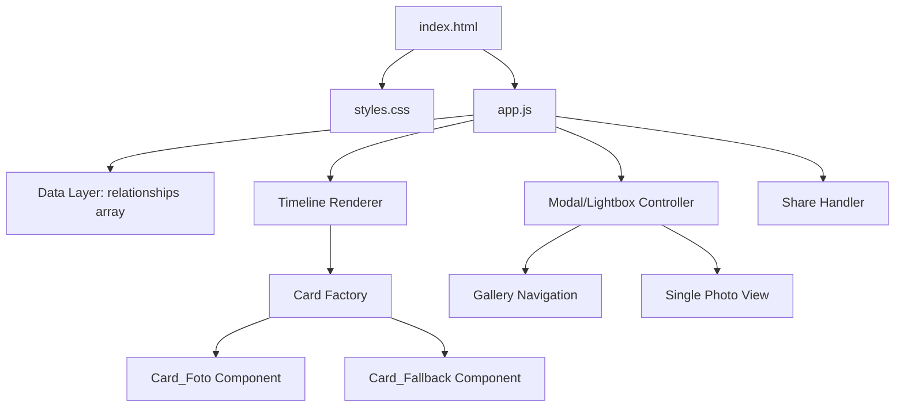
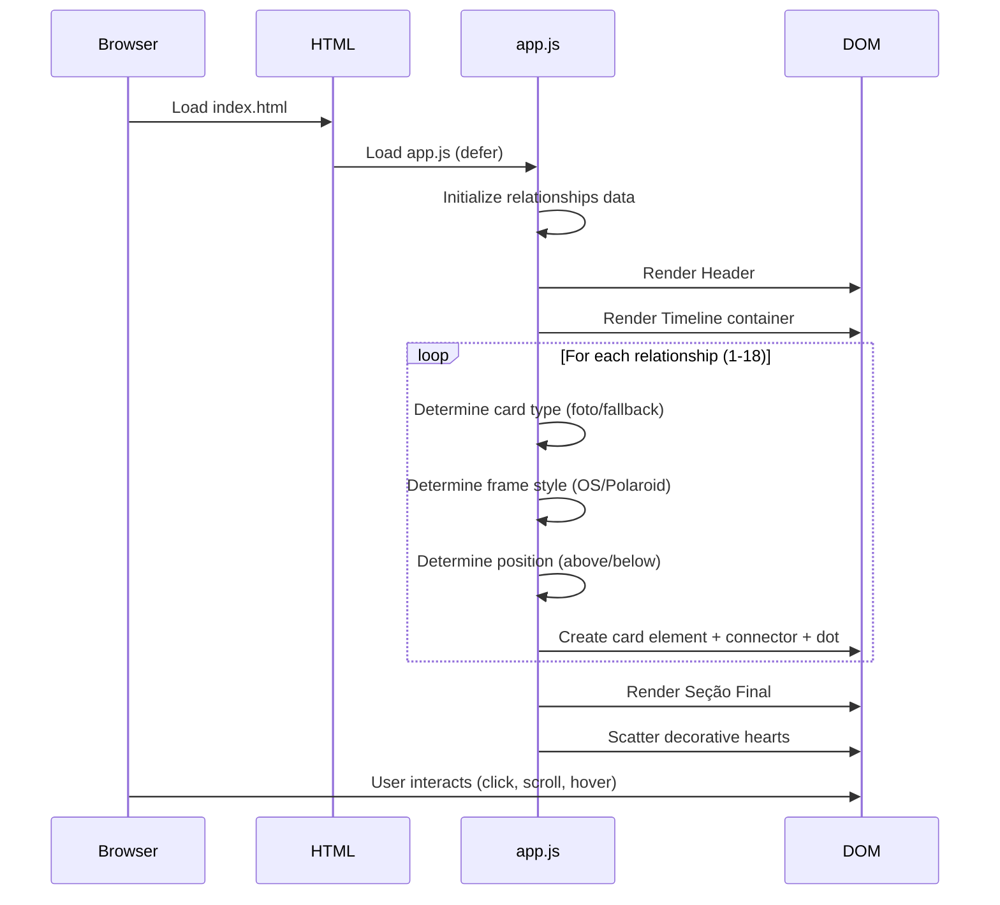

# Design Document: Relationship Timeline

## Overview

Site estático interativo estilo scrapbook que apresenta uma timeline horizontal de 18 relacionamentos passados. Construído com HTML, CSS e JavaScript vanilla, o site é servido como arquivos estáticos do diretório `/public/`. A experiência principal é o scroll horizontal por cards decorados alternando acima/abaixo de uma linha central, com molduras alternando entre estilo janela de OS antigo e Polaroid, galeria modal para múltiplas fotos, e visual de diário artesanal com fontes manuscritas e corações decorativos.

### Design Decisions

1. **Single HTML file + CSS + JS separados**: Mantém simplicidade e permite cache independente de estilos e lógica.
2. **Data-driven rendering via JavaScript**: Os dados dos relacionamentos ficam em um array JS, e o DOM é construído dinamicamente. Isso facilita manutenção (adicionar/remover exes requer apenas editar o array de dados).
3. **CSS Custom Properties para tema**: Variáveis CSS centralizam cores, fontes e espaçamentos do tema scrapbook.
4. **Event Delegation para modal**: Um único listener no container da timeline gerencia cliques em todos os cards, evitando memory leaks com muitos listeners.
5. **Progressive Enhancement para Web Share API**: Tenta `navigator.share()` primeiro; se indisponível, faz fallback para clipboard com feedback visual.

## Architecture



### File Structure

```
/public/
├── index.html          # Ponto de entrada, estrutura semântica
├── styles.css          # Estilos scrapbook, molduras, animações
├── app.js              # Lógica: rendering, modal, share
└── images/             # Fotos dos relacionamentos
    ├── Ismael.jpg
    ├── azevedo.jpg
    └── ...
```

### Rendering Flow



## Components and Interfaces

### 1. Data Layer (`relationships` array)

Responsável por definir a ordem cronológica, nomes, e mapeamento de fotos.

```javascript
// Interface de cada item do array
{
  id: number,           // 1-18, posição cronológica
  name: string,         // Nome de exibição
  photos: string[],     // Array de caminhos relativos de fotos
  hasFallback: boolean  // true se não tem foto
}
```

### 2. Timeline Renderer

Módulo responsável por construir toda a estrutura DOM da timeline.

**Responsabilidades:**
- Criar container com scroll horizontal
- Iterar sobre `relationships` e instanciar cards
- Posicionar cards alternadamente (ímpar = acima, par = abaixo)
- Criar linha horizontal, nós/dots, conectores verticais
- Distribuir corações decorativos

**Interface:**
```javascript
function renderTimeline(container, relationships) → void
```

### 3. Card Factory

Decide qual tipo de card criar com base nos dados.

**Interface:**
```javascript
function createCard(relationship, index) → HTMLElement
// index determina: posição (acima/abaixo), moldura (OS/Polaroid), rotação
```

### 4. Card_Foto Component

Renderiza um card com foto em moldura estilizada.

**Interface:**
```javascript
function createPhotoCard(relationship, frameType, rotation) → HTMLElement
// frameType: 'os' | 'polaroid'
// rotation: number (-3 to +3 degrees)
```

**Comportamentos:**
- Exibe foto principal (sufixo "01" ou primeira alfabética)
- Aplica moldura OS ou Polaroid conforme `frameType`
- Hover: scale + translateY com transition 200-400ms
- Click: abre modal (galeria se múltiplas fotos, single view se uma)
- Error handler: substitui por fallback após 5s timeout

### 5. Card_Fallback Component

Renderiza um card criativo sem foto.

**Interface:**
```javascript
function createFallbackCard(relationship, rotation) → HTMLElement
```

**Comportamentos:**
- Nome centralizado como elemento principal
- Elemento visual humorístico (silhueta, "?", mensagem temática)
- Truncamento com reticências se nome > 40 caracteres
- Mesmas dimensões e estilo de borda dos Card_Foto

### 6. Modal/Lightbox Controller

Gerencia abertura, navegação e fechamento do modal.

**Interface:**
```javascript
function openGallery(photos, startIndex) → void
function openSinglePhoto(photoSrc) → void
function closeModal() → void
function navigateGallery(direction) → void  // direction: 'prev' | 'next'
```

**Comportamentos:**
- Overlay escuro de fundo
- Navegação por botões e teclas de seta
- Indicador "N de T" para galeria
- Fechar: click fora, botão X, tecla Escape
- Retorno de foco ao card de origem
- Desabilitar prev na primeira foto, next na última

### 7. Share Handler

Gerencia compartilhamento via Web Share API ou fallback clipboard.

**Interface:**
```javascript
function handleShare() → Promise<void>
```

**Comportamentos:**
- Tenta `navigator.share({ title, url })`
- Fallback: `navigator.clipboard.writeText(url)`
- Feedback visual: texto muda temporariamente para "Link copiado! ✓"

## Data Models

### Relationship Data

```javascript
const relationships = [
  { id: 1,  name: "Erick",              photos: [],                                                                    hasFallback: true },
  { id: 2,  name: "Ismael",             photos: ["images/Ismael.jpg"],                                                 hasFallback: false },
  { id: 3,  name: "Valmir vôlei",       photos: [],                                                                    hasFallback: true },
  { id: 4,  name: "Fabio Jaboatão",     photos: [],                                                                    hasFallback: true },
  { id: 5,  name: "Otacílio",           photos: ["images/otacilio.jpg", "images/otacilioCasório.jpeg"],                 hasFallback: false },
  { id: 6,  name: "Fábio amigo de Jacó",photos: [],                                                                    hasFallback: true },
  { id: 7,  name: "Stenio",             photos: ["images/stenio.jpg", "images/stenio03.JPG", "images/stenio06.jpeg"],   hasFallback: false },
  { id: 8,  name: "Fábio Vôlei",        photos: ["images/FabioVôlei01.jpg", "images/fabioVôlei02.jpg", "images/fabioVôlei03.jpg", "images/fabioVôlei05.jpeg"], hasFallback: false },
  { id: 9,  name: "Pedro Codai",        photos: ["images/pedro01.jpg", "images/pedro04.jpeg", "images/pedro05.jpeg", "images/pedro07.jpeg", "images/pedro6.jpg", "images/pedro7.jpg"], hasFallback: false },
  { id: 10, name: "Henderson",          photos: ["images/Henderson05.jpg", "images/Henderson5.jpg", "images/henderson.JPG"], hasFallback: false },
  { id: 11, name: "Leandro",            photos: ["images/Leandro.jpg"],                                                hasFallback: false },
  { id: 12, name: "Márcio",             photos: ["images/marcio.jpg", "images/marcio01.jpg", "images/marcio04.jpg"],    hasFallback: false },
  { id: 13, name: "Nathan",             photos: ["images/Natan.JPG", "images/natan02.jpg", "images/natan03.JPG", "images/natan06.jpeg"], hasFallback: false },
  { id: 14, name: "Azevedo",            photos: ["images/azevedo.jpg", "images/azevedo02.jpg", "images/Azevedo07.jpg", "images/azevedo05.jpeg", "images/azevedo05.jpg", "images/azevedo06.jpg"], hasFallback: false },
  { id: 15, name: "Jairo",              photos: ["images/jairo&Eu01.jpg", "images/jairo02.jpg", "images/jairo03.jpg", "images/jairo06.jpeg", "images/jairoCasório.jpg"], hasFallback: false },
  { id: 16, name: "Robyson",            photos: ["images/robyson.jpg", "images/robyson02.jpg"],                         hasFallback: false },
  { id: 17, name: "Patrick",            photos: ["images/Patrick.jpg", "images/patrick02.jpg", "images/patrick05.jpg", "images/patric05.jpg"], hasFallback: false },
  { id: 18, name: "Izaac",              photos: ["images/izaac willians.jpg"],                                          hasFallback: false }
];
```

### Photo Selection Logic

```javascript
function getPrimaryPhoto(photos) {
  // 1. Buscar foto com sufixo "01" (case-insensitive)
  const primary = photos.find(p => /01\.(jpg|jpeg|png)$/i.test(p));
  if (primary) return primary;
  
  // 2. Fallback: primeira foto em ordem alfabética de nome de arquivo
  return [...photos].sort((a, b) => {
    const nameA = a.split('/').pop().toLowerCase();
    const nameB = b.split('/').pop().toLowerCase();
    return nameA.localeCompare(nameB);
  })[0];
}
```

### Card Position & Style Logic

```javascript
function getCardConfig(index) {
  // index é 1-based (posição cronológica)
  return {
    position: index % 2 === 1 ? 'above' : 'below',
    frameType: index % 2 === 1 ? 'os' : 'polaroid',
    rotation: (Math.random() * 6 - 3)  // -3 to +3 degrees
  };
}
```

### Modal State

```javascript
const modalState = {
  isOpen: false,
  photos: [],          // Array de fotos do relacionamento atual
  currentIndex: 0,     // Índice da foto sendo exibida
  triggerElement: null, // Referência ao card que abriu o modal (para retorno de foco)
  type: 'gallery' | 'single'  // Tipo de modal aberto
};
```


## Correctness Properties

*A property is a characteristic or behavior that should hold true across all valid executions of a system—essentially, a formal statement about what the system should do. Properties serve as the bridge between human-readable specifications and machine-verifiable correctness guarantees.*

### Property 1: Rendering produces one dot per relationship

*For any* array of relationships passed to the timeline renderer, the number of rendered dot elements on the timeline line should equal the length of the relationships array.

**Validates: Requirements 1.2**

### Property 2: Decorative hearts density

*For any* set of N rendered cards in the timeline, the number of decorative heart elements should be at least ⌈N/2⌉ (ceiling of N divided by 2).

**Validates: Requirements 1.3, 9.3**

### Property 3: Rendering preserves chronological order

*For any* ordered array of relationships, the rendered card elements in the DOM should appear in the same order as the input array (verifiable by data-id attributes matching array indices).

**Validates: Requirements 2.1**

### Property 4: Alternating card positions

*For any* card at 1-based index i in the timeline, if i is odd the card should be positioned above the timeline line, and if i is even the card should be positioned below.

**Validates: Requirements 2.2**

### Property 5: Every card has a vertical connector

*For any* rendered card in the timeline, there should exist a corresponding vertical connector element linking it to a dot on the timeline line.

**Validates: Requirements 2.3**

### Property 6: Photo card structural completeness

*For any* relationship that has photos, the rendered Card_Foto should contain both an img element with object-fit: cover styling AND a text element displaying the relationship name.

**Validates: Requirements 3.1, 3.2**

### Property 7: OS frame title bar structure

*For any* card rendered with Moldura_OS frame type, the element should contain a title bar with exactly 3 colored decorative circle elements (red, yellow, green).

**Validates: Requirements 3.3**

### Property 8: Polaroid frame rotation and border

*For any* card rendered with Moldura_Polaroid frame type, the element should have a CSS rotation transform between -5 and +5 degrees AND a white bottom border area with minimum height of 30px.

**Validates: Requirements 3.4**

### Property 9: Fallback card structure

*For any* Card_Fallback, the rendered element should display the relationship name (truncated to 40 characters with ellipsis if exceeding) AND contain at least one humorous visual element (silhouette, question mark, or themed message).

**Validates: Requirements 4.2, 4.3**

### Property 10: Image load timeout triggers fallback

*For any* Card_Foto where the image fails to load within 5 seconds, the card should be replaced with its corresponding Card_Fallback.

**Validates: Requirements 4.5**

### Property 11: Primary photo selection

*For any* non-empty array of photo paths, the selected primary photo should be the one whose filename contains "01" before the extension (case-insensitive); if none matches, it should be the photo with the alphabetically first filename.

**Validates: Requirements 5.1**

### Property 12: Gallery navigation bounds

*For any* gallery with T photos and current index N, navigating "next" should result in index min(N+1, T-1) and navigating "prev" should result in index max(N-1, 0). The prev button should be disabled when N=0 and next button disabled when N=T-1.

**Validates: Requirements 5.3**

### Property 13: Gallery position indicator format

*For any* gallery modal state with current photo index N (0-based) and total T photos, the position indicator should display the text `${N+1} de ${T}`.

**Validates: Requirements 5.6**

### Property 14: File extension validation

*For any* filename string, it should be accepted as a valid image if and only if its extension (case-insensitive) is one of: .jpg, .jpeg, or .png.

**Validates: Requirements 6.4**

### Property 15: Card rotation within range

*For any* rendered card in the timeline, its CSS rotation transform value should be between -3 and +3 degrees (inclusive).

**Validates: Requirements 9.2**

### Property 16: Frame type alternation

*For any* Card_Foto at odd chronological position (1-based), the frame type should be Moldura_OS; for any Card_Foto at even position, the frame type should be Moldura_Polaroid.

**Validates: Requirements 9.4**

### Property 17: All image sources use relative paths

*For any* img element rendered in the timeline, the src attribute should be a relative path (not starting with "http://", "https://", or "/").

**Validates: Requirements 10.3**

## Error Handling

### Image Loading Failures

| Scenario | Handling |
|----------|----------|
| Image fails to load (onerror) | Start 5s timer; if still failed, replace with Card_Fallback |
| Image loads after timeout started but before 5s | Cancel timer, show photo normally |
| All photos of a relationship fail | Show Card_Fallback for that relationship |
| Invalid image extension in data | Skip during rendering, log warning to console |

### Modal Errors

| Scenario | Handling |
|----------|----------|
| Gallery opened with empty photos array | Close modal immediately, no-op |
| Navigation beyond bounds | Clamp to valid range (0 to T-1) |
| Focus return target removed from DOM | Focus body as fallback |

### Share API Errors

| Scenario | Handling |
|----------|----------|
| navigator.share() not available | Fall through to clipboard API |
| navigator.share() rejects (user cancelled) | No-op, dismiss silently |
| Clipboard API fails | Show inline error message "Não foi possível copiar" |

### Font Loading

| Scenario | Handling |
|----------|----------|
| Google Fonts CDN unavailable | CSS font-family stack falls back to `cursive` generic family |
| Custom font fails to load | System default cursive font renders |

## Testing Strategy

### Unit Tests (Example-Based)

Focus on specific scenarios and integration points:

- **DOM structure**: Header is first element, 18 cards rendered, final section after last card
- **Fixed data validation**: Correct 18 relationships in correct order, correct photo mappings per requirement 6.2
- **Specific fallback targets**: Erick, Valmir vôlei, Fabio Jaboatão, Fábio amigo de Jacó render as fallback
- **CSS properties**: hover transitions, font-family includes cursive fallback, responsive breakpoints
- **Modal interactions**: click outside closes, Escape closes, focus returns to trigger element
- **Share behavior**: Web Share API path and clipboard fallback path
- **Accessibility**: modal traps focus, keyboard navigation works

### Property-Based Tests

Validate universal properties across generated inputs using **fast-check** (JavaScript PBT library).

Configuration: **Minimum 100 iterations per property test**.

Each property test tagged with: `Feature: relationship-timeline, Property {N}: {description}`

**Property tests to implement:**

1. Dots count invariant (Property 1)
2. Hearts density invariant (Property 2)
3. Order preservation (Property 3)
4. Card position alternation (Property 4)
5. Connector existence (Property 5)
6. Photo card structure (Property 6)
7. OS frame structure (Property 7)
8. Polaroid frame structure (Property 8)
9. Fallback card structure (Property 9)
10. Primary photo selection logic (Property 11) — excellent pure function candidate
11. Gallery navigation bounds (Property 12) — excellent pure function candidate
12. Position indicator formatting (Property 13) — excellent pure function candidate
13. File extension validation (Property 14) — excellent pure function candidate
14. Rotation range (Property 15)
15. Frame type alternation (Property 16)
16. Relative paths only (Property 17)

### Testing Tools

- **Test Runner**: Vitest (lightweight, fast, native ESM support)
- **PBT Library**: fast-check (mature JS property-based testing library)
- **DOM Testing**: jsdom environment in Vitest for DOM manipulation tests
- **No browser needed**: All tests run in Node.js with jsdom

### Test Organization

```
/public/
├── __tests__/
│   ├── unit/
│   │   ├── data.test.js          # Fixed data validation
│   │   ├── modal.test.js         # Modal interaction examples
│   │   └── share.test.js         # Share API behavior
│   └── properties/
│       ├── timeline.property.js  # Properties 1-5 (timeline structure)
│       ├── cards.property.js     # Properties 6-9 (card rendering)
│       ├── photos.property.js    # Properties 11, 14 (photo logic)
│       ├── gallery.property.js   # Properties 12-13 (gallery logic)
│       └── layout.property.js    # Properties 15-17 (visual layout)
```
